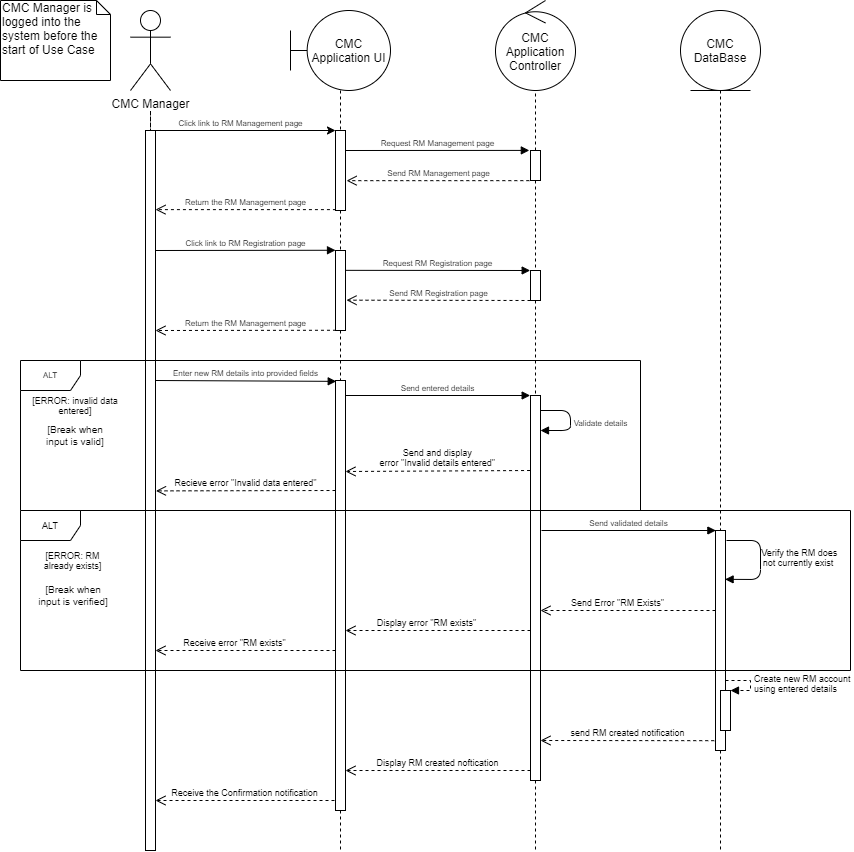
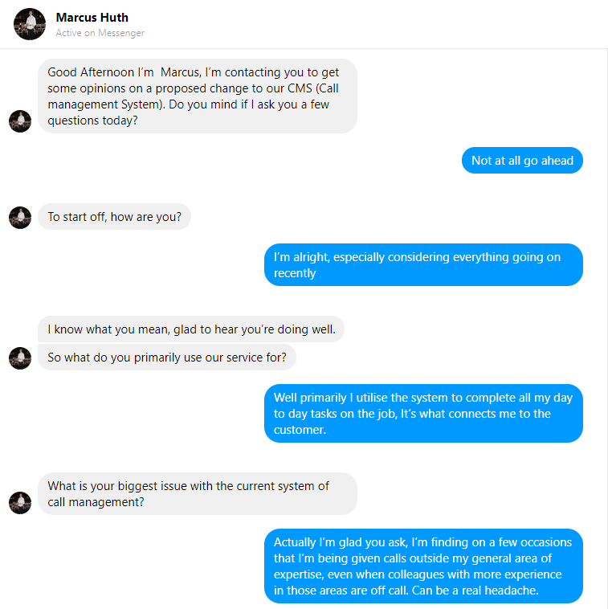

# Travel Company CMC Upgrade Proposition Report

_12910321(Jett Hendry)_  
_12933610(Matthew Fouad)_  
_13381177 (Marcus Huth)_  
_12590143 (Mikhail Fedulov)_

___
## Index
**Current Problem and Objectives of the Project Section**  
[Background](#Background)  
[Objectives](#Objectives)  
[Problem Definition](#Problem-Definition)  
[Assumptions](#Assumptions)  
[KPIs](#KPIs)  

**Stakeholder Analysis Section**    
[Stakeholder POV](#Stakeholders-POV)  
[Stakeholder Analysis Table](#Stakeholder-Analysis-Table)  
[Stakeholder Interest & Influence Grid](#Stakeholder-Interest-and-Influence-Grid)  
[Stakeholder Empathy Maps](#Stakeholder-Empathy-Maps)  

**User Story Backlog/Solution Approach Section**  
[User Story Backlog](#User-Story-Backlog)  
[Approach to Project Solution](#Approach-to-Project-Solution)  

**Data Modelling Section**   
[Use Case Narratives](#Use-Case-Narratives)  
[Activity Diagrams](#Activity-Diagrams)  
[Collaborative/Sequence Diagrams](#collaborativesequence-diagrams)  
[Use Case Diagram](#Use-Case-Diagram)   
[Class Diagram](#Class-Diagram)  
[UI Mockups](#UI-Mockups)

**Solution Benefits and Project Failure Effects Section**  
[Competitive Advantages](#Competitive-advantages)  
[Project Failure Impact](#Project-Failure-Impact)

**Appendix**   
[GitHub Repository Link](#GitHub-Repository-Link)  
[Google Drive Link](#Google-Drive-Link)  
[Roleplay Interviews](#Stakeholder-Role-Play-Interviews)    

___
## Current Problem and Objectives of the Project

### Background
Travel companies always strive for customer excellence in everything they do. In the dynamic world, customers' behaviour and needs constantly change motivating companies to adapt and go beyond customer expectations in the way they interact and build relationships. Major Travel Company (MTC) desires to improve the operations of their in-house customer management centre (CMC), the “human-face” of the customer service, by developing a new information system. The system will influence Relationship Managers sales and assist with the current and potential customers interactions. The system will be deployed to assist with both, inbound and outbound calls and will be able to communicate with other enterprise systems including, HR and customer profile creation tool Profiler Tool. The system will target a wide range of customer relationship aspects and features call routing, Interactive Voice Response, customer-to-RM matching, customer target list generation, RM skill score calculation, customer score calculation, and data analysis.

MTC approached us to conduct the project due diligence and develop a business report for the executive team based on the project strategic fit.

### Objectives
For the project to be successful the following objectives have been extracted from the project debrief and the client’s needs. The client desires a more efficient and robust system which will be able to distribute the CMC load accordingly now and in the future. Based on the information provided by the client, three primary objectives have been identified which will influence the decision making process throughout the project life cycle:

1. Improve customer experience which will reflect on 2% lower churn rate after one year of operations of the new system.  
2. Increase travel packages sales by 10px within the first year of the new system implementation.
3. Minimise costs of inbound calls by 20% within the first year of the new system implementation.

This report includes the key information required for successful project delivery including KPIs, stakeholder analysis, project assumptions, system design including workproducts and practical models, and identifies competitive advantages that might be gained in developing the new system.

### Problem definition
#### Problem Statement
Based on the Stakeholder Analysis and POVs of each stakeholder category we have defined an overarching problem statement that incorporates various aspects of the project.

Currently, the operations of CMC relies on a lot of manual data manipulations from the working staff and its overall performance is challenging to keep a track of. Analysis of each stakeholder group indicates a need for a more robust and reliable system which can be used to better customer service.
The incremental loss in efficiency means that MTC has not been meeting its sales and portfolio goals over the last 3 years which has pushed the churn rate to alarming levels.
To reduce the CMC operations costs, increase sales and improve customer satisfaction, a new automated system will be implemented. By replacing the current manual system with a more automated one, MTC will address the existing issues and gain competitive advantage on the market.

### Assumptions
1. For the purpose of this project, it is assumed that customer profile creation tool Profiler Tool has been implemented, tested, and supports communication with other enterprise systems including the new CMC system.
2. HR system that creates profiles for Relationship Managers upon hiring and is capable of building matrices for each employee that later can be communicated to other enterprise systems including the new CMC system.
3. Project has been approved by the MTC Executives and investors and has passed fthe inancial due diligence.
4. The project rollout is well thought out by the implementation team to minimise CMC downtime.  
5. The existing CMC operations rely on manual input and data manipulation from the users including, Relationship Managers, Business Analysts  and IT.
6. MTC has had an incremental loss due to low CMC efficiency. Sales and portfolio goals weren’t met in the last 3 years which led the company to reevaluate CMC operations.
7. MTC will source the project team from internal and external resources.
7. There are no barriers for the project implementation at this stage.

### KPIs
To measure the project success and whether the project objectives have been satisfied, the new system performance needs
to be monitored over a period of 1 year and analysed against the performance of the legacy software.

Improve customer experience
* Customer Satisfaction
* Churn Rate
* Retention Rate

Increase travel packages sales
* Number of packages sold
* Individual RM’s average sales
* Sales Growth Increase

Minimise costs of inbound calls
* Savings
* Cost Reduction
* Cost Avoidance

___
## Stakeholder Analysis
To determine the project scope and requirements the team has identified a list of key stakeholders which will be involved in the project. The team was able to define Point-of-Views for each of the stakeholder types as well as interest and influence table followed by empty maps. 

## Stakeholders POV

### Internal Stakeholders
* **Major travel Company executive team**  
The **executive team of the major travel company**. They will ultimately have the final say over the entire project as they hold the highest authority within the company. The MTC executive team **needs** the proposed system to improve the sales figures of the CMC centre and increase the positive reception of the CMC experience by the customer **because** They are responsible for ensuring the company investors and shareholders are adequately satisfied with the businesses current projects.

* **RM (Relationship Managers)**
The **Relational Managers** are employees that currently work in the CMC department. They are tasked with providing support and ensuring sales to customers calling in. The proposed CMC upgrade solution will directly affect these stakeholders day to day work efficiency and therefore they will be high priority points of contact in project solution development feedback. The RM **needs** a system that is capable of finding customers with requirements that directly correlate with their own knowledge **because** RMs as we found during roleplay are far more confident in their sales ability if their knowledge is relevant.

* **CMC management**  
The **CMC Management** is the personnel overseeing the CMC department. They are responsible for the efficient functioning of the travel companies call center operations. As they are also closely associated with the utilization of the finished CMC solution they will be consulted regularly alongside the RMs during project development. The CMC Management **needs** a solution that reduces the need for manual micromanagement of RM’s and improves their RMs’s confidence in sales calls **because** the overall functioning of the CMC is a direct reflection on them, an increase in proficiency will affirm their departments importance.

* **Project Team/System Administrators**  
The **project team** is a combination of internal and external resources and is responsible for the project implementation. They will be working closely with the other stakeholder during the project development. The project team **needs** to provide a solution which appeases all stakeholders needs **because** the quality and acceptance of the system will directly affect the  likelihood of their use in future projects.

* **Other CMC employees (Business Analysts, IT department, Cyber Security ect.)**  
Other **CMC employees** that have been hired by MCT to assist with the call center day-to-day tasks, interact with the system in a unique and niche way. They will be working closely with the RMs and the management to ensure the system is up and running. The other employee's **needs** for the proposed system are robustness, usability, and maintainability in various aspects including business performance analysis, IT configurations, and information security **because** the overall functioning of the system is the direct reflection on them and the quality of their work.

### External Stakeholders

* **Customers**  
A **Customer** pertains to any individual who will be utilizing the product upon its release in order to make purchases. As these individuals are the companies target for sales, they are paramount to the solutions success from implementation onwards as well as the businesses ongoing success. The customer **needs** an improved efficiency in call management to reduce the on-line waiting times and when connected can ensure a high level of knowledge from the staff **because** these factors drastically affect the opinions and experiences of the customer in turn reflecting in sales numbers.

* __Company Investors and Shareholders__  
__Investors/Shareholders__ Those that fund the companies ventures and have financial stakes in the ongoings of the travel company. As they are the financial contributors of the company they are the stakeholders that the executive team are most focused on pleasing and therefore their needs must be met by the development teams solution. The investor/shareholder **needs** solutions that will directly increase their shares value in the market as well as future proof their investment in the business **because** ultimately, investors/shareholders are solely concerned with economic value and without them the business would lose funding.

___

## Stakeholder Analysis Table
To better understand which stakeholders the team needs to engage the most the stakeholders interest and inflict table has been created. By prioritising stakeholders in this way, the team was able to clearly see how to communicate with stakeholders and keep them satisfied. 

Stakeholder | Interests | Influence (High - Low) | Priority (1 - 3; Critical - Low)
--- | --- | --- | ---
**MTC Executive Team** | Overall profitability; Satisfaction of investors/shareholders; Achieving targets | Medium/High – have the final say regarding all financial and executive decisions on the project | 2 (High)
**Relationship Managers (RMs)** | Maintaining positive customer relationships; Maximising sales; Address needs of customers | High – with regard to their position influence is relatively minor. However, they are directly impacted in their ability to perform their role by new system so input from them is important | 1 (Critical)
**CMC Managment Team** | Minimal disruption to services; Efficient allocation of resources (time, physical, monetary) | Medium – oversee the entirety of CMC (including RMs) and indirectly involved in rollout and maintenance of system | 2 (High)
**Projects Team/System Administrators** | Satisfaction of user requirements; Smooth rollout of system; Adherence to development timeline | High – tasked with and responsible for the design and implementation of the new system | 1 (Critical)
**Other CMC Employees** |System performance and agility; System accessibility and maintainability | Low -  Although, they are directly impacted in their ability to perform their role by new system they have little influence over the system configurations and options. |  3 (Low)
**Customers** | Positive interactions; Minimal wait times | Medium/High – not directly involved with development process. However, customer interests and behaviours drive design decisions regarding new system | 1 (Critical)
**Investors and Shareholders** | Maximising profits; Positive company image | Medium – must have needs met by proposed solution in order to receive funding | 2 (High)

___
## Stakeholder Interest and Influence Grid
The grid below is a visual representation of the table.

___
## Stakeholder Empathy Maps
Below are two empty maps that the team had developed to better understand Customer and RM’s position within the project. The team focused on those two types of stakeholders because they interact with the system the most and their interactions directly rely on the system performs. 

### RM Empathy Map

### Customer Empathy Map

### CMC Manager Empathy Map

___
## User Story Backlog
After identifying the stakeholders’ needs and analysing their position and level of influence in the project, the team developed a backlog of all the key user stories which will be used to prototype and create the system. The backlog includes all seven stakeholder types and their needs summaries in the classic user story format. 

|  **User Story #** | **As a/an** | **I want to...** | **So that...** | **Estimates** | **Priority** | **Story Type** | **Process/ Service** |
| :---: | :---: | :---: | :---: | :---: | :---: | :---: | :---: |
|  Example STORY | Staff Member | view a list of all devices in the system | find the product number for a listed device. | 5 | High | Story | Product Management |
|  **RELATIONSHIP MANAGER** |  |  |  |  |  |  |  |
|  101 | Relationship Manager | be able to see a summary of sales per day/week/month/year | I can track my progress and report it to the management. | 12 | Medium | Epic | Sales Review |
|  102 | Relationship Manager | be able to view customer details | I can provide efficient service tailored to the customer | 5 | High | Story | Call Facilitation |
|  103 | Relationship Manager | be able to edit customers profiles | I can keep their profiles up to date | 8 | High | Story | Customer Profile Management |
|  104 | Relationship Manager | get a list of potential customers(target list) for outboound calls | I can source new sales | 8 | High | Story | Outgoing Call Operation |
|  105 | Relationship Manager | be given a matching proposed product(s) for each customer in my target list | I have background knowledge of customers need before calling | 8 | High | Story | Outgoing Call Operation |
|  106 | Relationship Manager | record the number of successful calls (sales) made | I can track my performance | 3 | Medium | Story | Sales Review |
|  107 | Relationship Manager | have calls from customers directed to me based on our compatibility | I can assist with their queries more effciently and customise the answer | 8 | High | Epic | Matching RM & Customer |
|  108 | Relationship Manager | search for a customer profile based on full name | I can find their previous records with the CMC | 5 | Medium | Story | Customer History |
|  109 | Relationship Manager | search for a customer profile based on phone number | I can find their previous records with the CMC | 5 | Medium | Story | Customer History |
|  110 | Relationship Manager | view sales history of a customer | I can get a more accurate gauge on customers past sales | 3 | High | Story | Customer History |
|  111 | Relationship Manager | be provided with a script for outgoing calls | I can better perform in outbound calls | 2 | Medium | Story | Outgoing Call Operation |
|  112 | Relationship Manager | be provided with a guideline for outgoing calls | I can better perform in outbound calls | 2 | Medium | Story | Outgoing Call Operation |
|  113 | Relationship Manager | log in using my employee ID and password | I can utilise the CMC system | 2 | High | Story | Log In |
|  114 | Relationship Manager | change my password | I can update my password when needed | 1 | Low | Story | RM Account Managment |
|  115 | Relationship Manager | change my email | I can update my email when needed | 1 | Low | Story | RM Account Managment |
|  116 | Relationship Manager | identify my knowledge areas (travel destinations, local attractions etc.) | the CMC system can understand where my strengths lie | 5 | High | Story | RM Account Managment |
|  117 | Relationship Manager | be able to call customers back in the event of the a call dropout | I do not lose customers to call malfunction | 1 | High | Story | Call Facilitation |
|  **SYSTEM ADMIN** |  |  |  |  |  |  |  |
|  201 | System Admin | assign each customer a score based on criteria (likelyhood to buy etc.) | I can ensure good matches between the customer and RM | 8 | High | Story | Matching RM & Customer |
|  202 | System Admin | modify the threshold at which customers are directed to the Interactive Voice Response (IVR) | I can optimise the CMC performance and keep customers on the line and engaged | 3 | High | Story | Call Facilitation |
|  203 | System Admin | have the system to prompt options to customers during IVR including reasons for calls, Travel destination etc. | The RM selection process can be done effciently | 5 | High | Story | Call Facilitation |
|  204 | System Admin | have the system determine best candidate RM for customer | The RM connection to Customer can be facilitated | 12 | High | Epic | Matching RM & Customer |
|  205 | System Admin | have the system rate customers on their likelihood to buy | The customers can be prioritised | 5 | Medium | Story | Matching RM & Customer |
|  206 | System Admin | have the system prioritise RM connection to customers with a high buy likelihood score | Customers more likely to buy are serviced first | 2 | Medium | Story | Matching RM & Customer |
|  207 | System Admin | provide the customer with a 10 minute questionaire when first calling | The system can build a profile for them | 2 | High | Story | Call Facilitation |
|  208 | System Admin | store customer sales history | it can be accessed for future sales and archiving | 5 | High | Story | Customer Profile Management |
|  209 | System Admin | store customer details | they can be accessed for sales purposes | 5 | High | Story | Customer Profile Management |
|  210 | System Admin | store RM details | they can be used for system processes | 5 | High | Story | RM Account Management |
|  211 | System Admin | have the system calculate a rating for RM's based on average call time etc. | The RM connection to Customer can be facilitated | 8 | High | Story | Matching RM & Customer |
|  212 | System admin | ensure that information input at login by users is validated (no sql injection etc.) | No user can input incorrectly structured login data | 8 | High | Story | Log In |
|  213 | System admin | ensure that information input at login by users is verified | I can ensure that the user is logged in to the correct account | 8 | High | Story | Log In |
|  214 | System admin | ensure that information input at registration is validated |  |  |  |  | Registration |
|  215 | System admin | ensure that information input at registration is verified |  |  |  |  | Registration |
|  **CMC Manager** |  |  |  |  |  |  |  |
|  301 | CMC Manager | be provided with high level reports of CMC performance | I can monitor performance and make strategic decisions | 5 | High | Epic | Sales Review |
|  302 | CMC Manager | view individual RM sales history | I can monitor RM performance on an individual basis | 5 | Medium | Story | Sales Review |
|  303 | CMC Manager | create an RM account | RM's have a profile to utilise the system| 8 | High | Story | RM Account Management |
|  304 | CMC Manager | deactivate an RM account | employees no longer working for the company cannot access the system  | 2 | Medium | Story | Rm Account Management |
|  305 | CMC Manager | view the current status of each RM (on call, waiting, performing outgoing calls, on break etc.) | I can manage the RMs in changing times of demand | 3 | Medium | Story | Call Facilitation |
|  306 | CMC Manager | view a list of the days sales | I can review the daily earnings | 2 | Low | Story | Sales Review |
|  307 | CMC Manager | view a list of the monthly sales | I can review the monthly earnings | 3 | Medium | Story | Sales Review |
|  308 | CMC Manager | view a list of the annual sales | I can review the annual earnings | 5 | Medium | Story | Sales Review |
|  **CUSTOMER** |  |  |  |  |  |  |  |
|  401 | Customer | call the Major Travel Company using a provided phone number | I can contact the Major Travel Company | 1 | High | Story | Call Facilitation |
|  402 | Customer | give details of what I'm looking for when first calling | I get the correct service provided by the CMC | 3 | High | Story | Call Facilitation |
|  403 | Customer | be remembered as a return customer | the company knows I am a prior buyer | 1 | High | Story | Matching RM & Customer |
|  404 | Customer | be connected with an employee with knowledge of my destination | I get all the information needed for my travel package | 12 | High | Epic | Matching RM & Customer |
|  405 | Customer | have the option to request RM's I have previously talked to | I can continue to get service from those I am familiar with | 3 | Medium | Story | Matching RM & Customer |
|  406 | Customer | be given ample time with an RM | I can be confident in my purchase choice | 1 | Medium | Story | Call Facilitation |
|  407 | Customer | provide feedback on call quality | I can provide my opinion of my business | 2 | Low | Story | Feedback |
|  408 | Customer | be reconnected with an RM in the event of a call dropout | I can continue my enquiry process | 3 | High | Story | Call Facilitation |
|   |  |  |  |  |  |  |  |
|  **NON-FUNCTIONAL REQUIREMENTS** |  |  |  |  |  |  |  |
|  501 | Customer | be connected to an RM in under 10 minutes | I am not waiting too long for service | 8 | Medium | Story | Matching RM & Customer |
|  502 | Customer | be provided with at minimum 3 options for travel packages | I have flexibility in choice of package | 3 | Medium | Story | Call Facilitation |
|  503 | Customer | have my details kept confidential | My details are secure | 2 | High | Story | Customer Profile Management |
|  504 | Customer | The questionaire given to be discernible | I can understand what is being asked | 1 | High | Story | Call Facilitation |
|  505 | Relationship Manager | have my details kept confidential | My details are secure | 3 | High | Story | RM Profile Management |
|  506 | Relationship Manager | be given a minimum of 20 calls per day (volume permitting) | I have enough opportunities for potential sales daily | 5 | Medium | Story | Call Facilitation |
|  507 | Relationship Manager | be logged into the system within 2 minutes | I can access the system in a timely manner | 2 | Medium | Story | Log In |
|  508 | Relationship Manager | be able to specialise in at least 3 destinations | the system can find more potential customer matches for me | 2 | Medium | Story | Matching RM & Customer |
|  509 | Relationship Manager | be given a minimum of 10 call targets in my daily outgoing target list (volume permitting) | I have enough opportunities for potential sales daily | 5 | Medium | Story | Call Facilitation |
|  510 | Relationship Manager | be shown search results for customer lookup within 5 seconds | I can effciently obtain information on customers | 3 | High | Story | Customer Profile Management |
|  511 | Relationship Manager | have my account edits immediately registered in the system | there is no disparity in my details | 1 | High | Story | RM Profile Management |
|  511 | CMC Manager | be shown search results for RM lookup within 5 seconds | I can effciently obtain sales figures of RMs | 3 | Medium | Story | RM Profile Management |
|  512 | CMC Manager | be shown sales figures lists (daily, monthly, annually) within 1 minute | I can access them for review in a timely manner | 5 | low | Story | Sales Review |
|  513 | CMC Manager | have an RM account created immediately after request | the profile is created in a timely manner | 1 | High | Story | RM Profile Managment |
|  514 | CMC Manager | have an RM account deactivated immediately after request | the profile cannot be accessed after deactivation | 1 | High | Story | RM Profile Managment |   

___

## Approach to Project Solution
### How-Might-We
To further understand the problem areas the team developed a series of How-Might-We questions based on insights found during the research phase. The goal was to state questions that are broad enough that provide a wide range of possible solutions yet narrow enough that the project has helpful boundaries. The questions were derived from each stakeholder category and were designed to be actionable, but not targeted to a specific project area:

* **Major travel Company executive team**
1. How might we improve yearly sales for the CMC center so that the company generates higher revenue.
2. How might we increase the positive reception for the CMC customers so that the company has a better publick outlook and more return customers.
3. How might we raise the company evaluation so that the company investors and shareholders are abiquently satisfied.

* **RM (Relationship Managers)**
1. How might we be more efficient when interacting with customers so that our sales go up.
2. How might we reduce manual tasks so that we can reach more customers a day.
3. How might we find customers with requirements that directly correlate with their own knowledge

* **CMC management**
1. How might we reduce micromanagement of the Relationship Managers so that the team spends less time on unnecessary operations.
2. How might we increase RM’s confidence in sales calls so that the relevant training and support is provided only when needed.
3. How might we improve the CMC proficiency so that the department has a better outlook and funding.

* **Project Team**
1. How might we develop a solution that appeases all stakeholders needs so that the project goals are achieved.
2. How might we develop a high quality solution so that it passes other stakeholders acceptance testing.
3. How might we develop the solution on time so that the project will be complimented within the boundaries of the allocated budget.

* **Other CMC employees**
1. How might we have a robust system that is easy to interact with so that we can be more efficient at processing ongoing maintenance requests.
2. How might we improve the system so that we can produce more quality work.

* **Customers**
1. How might we receive a better and more personolised service so that we would be encouraged to come back.
2. How might we be processed with greater efficiency so that we don’t have to wait a long time on the phone.

* **Company Investors and Shareholders**
1. How might we provide better support to the company so that the company market share value will increase.
2. How might we create more positive economic environment for the company so that the company has secure funds for further improvements.

___

## Brainstorm
After all key stakeholders have been identified and their needs understood the team conducted a brainstorm session to identify possible solutions for the project. From the Point-of-View statements and interviews with the selected stakeholder representatives, the team was able to create a backlog which was used during the brainstorming activity. The primary objective of conducting the brainstorming activity was to find potential solutions for How-Might-We statements that were developed earlier. The team tried to answer those questions and provide actionable ideas to the client problem. 

### Suggestions / Ideas:

**Idea 1:** Interactive Voice Response (IVR) sub-system
* Advantages - Fast response to customers, Able to process and direct customer requests faster, Reduced pressure on RMs
* Disadvantages - Additional sub-system, Additional costs, Customers perception of IVR systems

**Idea 2:** Sales History
* Advantages - Accelerated access to financial records for varios periods (day/week/month/year etc.), Automated revenue calculation, Reduced pressure on Finance & Tax teams
* Disadvantages - Additional sub-system to handle, IT team overhead, Additional costs, Requires more computational powers 

**Final Decision:**

After discovering stakeholder needs follow by How-Might-We statements from MTC executive team and Relationship Managers about customers processing time and costs reduction, Idea 1 was formed. It was understood that RMs experiencing extra pressure on processing customer requests during busy periods which impacts their performance. IVR would be able to recognise customer requestions before they they are passed on to RMs and therefore direct calls to RMs with suitable expertise to solve their queries. 

Idea 2 was formed based on MTC Management team and CMC Management to minimise costs and have a transparency in financial recordings within the organisation.  

**Action Items:**  It is likely that the stakeholder majority will support both ideas, however, they needs to be clearly communicated to the stakeholder groups to ensure they are understand the implications and don’t have any objections against the proposed solutions.

___

## Agile Methodology Utilization in Project Solution Development
To produce this document, agile methodologies and Design Thinking steps were used by the team. This allowed the team to structure the approach to problem solving and information gathering. The development process was split into 4 iterations, each one week long, that were used to gather and analyse valuable insights. Early in the process the team establish communication channels with various stakeholders which accelerated the process of the information gathering. The team communicated clearly with all stakeholders throughout the 4 iterations to ensure transparency and accuracy of information exchanged. 

As part of the design thinking step 2 the team conduct clients role play interviews, the script can be found in the Appendix C

Below are the objectives that were set for each iteration.

Sprint 1:
Identify stakeholders 
Define problem & Objectives 
Empathy Map
POVs
Backlog
Introduction
Stakeholder power-interest Grid
Questions to Stakeholders
Assumptions 

Sprint 2:
List assumptions
Prioritised Backlog
Stakeholder interviews
Finish POVs

Spring 3:
Competitive advantage
Risks (possible effects if the project fails)
Assumptions modify
Explain agile methodology
Workproducts 1 - develop Use Cases
Workproducts 2 - develop Use Case Diagram
Workproducts 3 - develop Activity Diagram 
Workproducts 4 - develop Class Diagram
Workproducts 5 - develop Collaborative diagram
Workproducts 6 - develop UI mockups 

Sprint 4:
Finish Workproducts 1 - develop Use Cases
Finish Workproducts 2 - develop Use Case Diagram
Finish Workproducts 3 - develop Activity Diagram 
Finish Workproducts 5 - develop Collaborative diagram
Competitive advantage
Design thinking principle
Risks (possible effects if the project fails)

___

## Use Case Narratives
### Use Case 303
<table>
  <tr>
   <td><strong>Use Case ID</strong>
   </td>
   <td>UC:303 - Create a Relationship Manager account
   </td>
  </tr>
  <tr>
   <td><strong>User Story</strong>
   </td>
   <td>As a CMC Manager  I want to create an RM account so that RM's have a profile to utilise the system
   </td>
  </tr>
  <tr>
   <td><strong>Goal </strong>
   </td>
   <td>Create a new RM account in the system
   </td>
  </tr>
  <tr>
   <td><strong>Priority</strong>
   </td>
   <td>H
   </td>
  </tr>
  <tr>
   <td><strong>Actors</strong>
   </td>
   <td>Primary Actor – CMC Manager

Secondary Actors –  CMC System
   </td>
  </tr>
  <tr>
   <td><strong>Pre-conditions</strong>
   </td>
   <td>The CMC system is active.

There is a new RM that needs to be registered
   </td>
  </tr>
  <tr>
   <td><strong>Post-conditions</strong>
   </td>
   <td>The RM has an account that they can access
   </td>
  </tr>
  <tr>
   <td><strong>Trigger</strong>
   </td>
   <td>The CMC manager logs into the CMC system
   </td>
  </tr>
  <tr>
   <td><strong>Main Flow</strong>
   </td>
   <td>
<ol>

<li>The CMC application displays the default landing page for CMC Managers.  

<li>The CMC manager selects the RM management option.

<li>The CMC application displays the RM management page.

<li>The CMC manager selects the RM registration option.

<li>The CMC application displays the RM registration page.

<li>The CMC manager enters the required information into the presented fields.

<li>The CMC manager clicks the confirmation button. If an ‘existing RM’ error is displayed refer to <strong>alternative flow 1 ‘RM already exists’</strong>. If a ‘incorrect information’ error is displayed <strong>refer to alternative flow 2 ‘Details entered were incorrectly formatted’.</strong>

<li>The CMC application displays a confirmation message to show the RM account was created.

<li>The use case has now been completed.
</li>
</ol>
   </td>
  </tr>
  <tr>
   <td><strong>Exceptions</strong>
   </td>
   <td>E1.Steps 1-9 – CMC Manager closes the application window anytime.

E2.Steps 1-9 – The CMC system crashes
   </td>
  </tr>
  <tr>
   <td><strong>Includes</strong>
   </td>
   <td>
   </td>
  </tr>
  <tr>
   <td><strong>Supporting Information</strong>
   </td>
   <td>RM details must be stored on a central server

The RM accounts will be saved in a separate database table to CMC manager accounts
   </td>
  </tr>
  <tr>
   <td><strong>Non-functional Requirements</strong>
   </td>
   <td>Performance: Page load time.

Performance: System account confirmation time.

Design: registration form is understandable

Security: sensitive information is masked
   </td>
  </tr>
</table>

<table>
  <tr>
   <td><strong>Alternate Flow 1</strong>
   </td>
   <td>“RM already exists”  
   </td>
  </tr>
  <tr>
   <td><strong>Trigger</strong>
   </td>
   <td>An ‘existing RM’ error is displayed
   </td>
  </tr>
  <tr>
   <td><strong>Step</strong>
   </td>
   <td>
<ol>

<li>The CMC manager acknowledges the error.

<li>The CMC application removes the error popup and displays the registration page again

<li>The CMC manager makes changes to the entered information where necessary

<li>Re-join at Step 7 in the Main Flow.
</li>
</ol>
   </td>
  </tr>
  <tr>
   <td><strong>Alt Flow</strong>
   </td>
   <td>
    The CMC manager exits the CMC application
   </td>
  </tr>
  <tr>
   <td><strong>Post conditions</strong>
   </td>
   <td>The newly edited information is confirmed for registration
   </td>
  </tr>
  <tr>
   <td><strong>Exceptions</strong>
   </td>
   <td>E1.Steps 1-4 – CMC manager closes the browser window anytime.

E2.Steps 1-4 – The CMC system crashes
   </td>
  </tr>
</table>

<table>
  <tr>
   <td><strong>Alternate Flow 2</strong>
   </td>
   <td>“Details entered were incorrectly formatted”  
   </td>
  </tr>
  <tr>
   <td><strong>Trigger</strong>
   </td>
   <td>An ‘incorrect information’ error is displayed
   </td>
  </tr>
  <tr>
   <td><strong>Step</strong>
   </td>
   <td>
<ol>

<li>The CMC manager acknowledges the error.

<li>The CMC application removes the error popup and displays the registration page again

<li>The CMC manager makes changes to the entered information where necessary

<li>Re-join at Step 7 in the Main Flow.
</li>
</ol>
   </td>
  </tr>
  <tr>
   <td><strong>Alt Flow</strong>
   </td>
   <td>
    The CMC manager exits the CMC application
   </td>
  </tr>
  <tr>
   <td><strong>Post conditions</strong>
   </td>
   <td>The newly edited information is confirmed for registration
   </td>
  </tr>
  <tr>
   <td><strong>Exceptions</strong>
   </td>
   <td>E1.Steps 1-4 – CMC manager closes the browser window anytime.

E2.Steps 1-4 – The CMC system crashes
   </td>
  </tr>
</table>

___

### Use Case 103
<table>
  <tr>
   <td><strong>Use Case ID</strong>
   </td>
   <td>UC103: Direct Customers to Interactive Voice Response (IVR)
   </td>
  </tr>
  <tr>
   <td><strong>User Story</strong>
   </td>
   <td>US202 As a System Admin, I want to modify the threshold at which customers are directed to the Interactive Voice Response (IVR) so that I can optimise the CMC performance and keep customers on the line and engaged.
   </td>
  </tr>
  <tr>
   <td><strong>Goal </strong>
   </td>
   <td>System Admin needs to be able to set and modify the threshold of number of calls at which point callers will be automatically directed to the IVR to encourage caller retention and engagement.
   </td>
  </tr>
  <tr>
   <td><strong>Priority</strong>
   </td>
   <td>H
   </td>
  </tr>
  <tr>
   <td><strong>Actors</strong>
   </td>
   <td>Primary Actor – System Admin

Secondary Actor –  New CMC System
   </td>
  </tr>
  <tr>
   <td><strong>Pre-conditions</strong>
   </td>
   <td>The Relationship Manager has access to the NEW CMC System.

The System Admin has valid credentials
   </td>
  </tr>
  <tr>
   <td><strong>Post-conditions</strong>
   </td>
   <td>The System Admin has successfully set/modified the threshold at which callers are automatically directed to the IVR
   </td>
  </tr>
  <tr>
   <td><strong>Trigger</strong>
   </td>
   <td>The System Admin logs in to the CMC System application.
   </td>
  </tr>
  <tr>
   <td><strong>Main Flow</strong>
   </td>
   <td>
<ol>

<li>The system displays a landing page for System Admins.  

<li>The System Admin navigates to the IVR Management Tab by clicking on it in the navigation menu.

<li>The system displays IVR Management Page with the current status of the IVR system, along with options to manage the IVR system.The CMC application displays the RM management page.

<li>The System Admin selects the Threshold Control option by clicking on it.

<li>The system displays the Threshold Control page containing the currently set threshold, an input area to set a new threshold.

<li>The System Admin enters a new threshold number into the presented field.

<li>The System Admin clicks on the confirm button. If an ‘invalid value’ is entered, refer to <strong>Alternate Flow 1 ‘Invalid Value Entered’</strong>.

<li>The system displays a confirmation dialog box confirming that the threshold has been updated with the new value.

<li>The use case ends.
</li>
</ol>
   </td>
  </tr>
  <tr>
   <td><strong>Exceptions</strong>
   </td>
   <td>E1. Step 1-9 – The System Admin closes the application at any time.

E2. Steps 1-9 – The CMC application crashes.
   </td>
  </tr>
  <tr>
   <td><strong>Includes</strong>
   </td>
   <td>
   </td>
  </tr>
  <tr>
   <td><strong>Supporting Information</strong>
   </td>
   <td>CallManagement and IVR details need to be stored on a central server.

An ‘invalid value’ may be any numerical value outside set ranges, or any value entered in an invalid format (i.e. containing letters, non-whole number).
   </td>
  </tr>
  <tr>
   <td><strong>Non-functional Requirements</strong>
   </td>
   <td>Performance: Page load time.

Performance: Immediate system responsiveness to change.
   </td>
  </tr>
</table>

<table>
  <tr>
   <td><strong>Alternate Flow 1</strong>
   </td>
   <td>“Invalid Value Entered”  
   </td>
  </tr>
  <tr>
   <td><strong>Trigger</strong>
   </td>
   <td>The System Admin enters an ‘invalid value’ as a new threshold number.
   </td>
  </tr>
  <tr>
   <td><strong>Step</strong>
   </td>
   <td>
<ol>

<li>The system displays an error dialog box stating that ‘The value entered is not valid. Please enter a valid figure.’, and the new threshold value text field is cleared.

<li>The System Admin acknowledges the error.

<li>Re-join at Step 7 in the Main Flow.
</li>
</ol>
   </td>
  </tr>
  <tr>
   <td><strong>Post conditions</strong>
   </td>
   <td>The System Admin has successfully entered a new threshold value
   </td>
  </tr>
  <tr>
   <td><strong>Exceptions</strong>
   </td>
   <td>E1. Step 1-3 – The System Admin closes the application at any time.

E2. Steps 1-3 – The CMC application crashes.
   </td>
  </tr>
</table>

___

### Use Case 101
<table>
  <tr>
   <td><strong>Use Case ID</strong>
   </td>
   <td>UC101: View Individual Customer Sales History
   </td>
  </tr>
  <tr>
   <td><strong>User Story</strong>
   </td>
   <td>US110 As a Relationship Manager, I want to view sales history of a customer so that I can get a more accurate gauge on customers past sales.
   </td>
  </tr>
  <tr>
   <td><strong>Goal </strong>
   </td>
   <td>Relationship Manager needs to be able to view individual customer sales history to analyse the sales performance and make future plans.
   </td>
  </tr>
  <tr>
   <td><strong>Priority</strong>
   </td>
   <td>High
   </td>
  </tr>
  <tr>
   <td><strong>Estimates</strong>
   </td>
   <td>3
   </td>
  </tr>
  <tr>
   <td><strong>Actors</strong>
   </td>
   <td>Primary Actor – Relationship Manager

Secondary Actor – New CMC System
   </td>
  </tr>
  <tr>
   <td><strong>Pre-conditions</strong>
   </td>
   <td>The Relationship Manager has access to the NEW CMC System.

The Relationship Manager has a valid credentials
   </td>
  </tr>
  <tr>
   <td><strong>Post-conditions</strong>
   </td>
   <td>The Relationship Manager has successfully viewed a customer sales history via the New CMC System.
   </td>
  </tr>
  <tr>
   <td><strong>Trigger</strong>
   </td>
   <td>The Relationship Manager navigates to the New System on an internet browser.
   </td>
  </tr>
  <tr>
   <td><strong>Main Flow</strong>
   </td>
   <td>
<ol>

<li>The system displays a landing page with navigation menu, user basic details, and notifications.  

<li>The Relationship Manager navigates to the Customers Tab by clicking on it in the navigation menu. <strong>Alternate Flow 1 “Sales History Tab Option”</strong>.

<li>The system displays a list of existing customers that the RM interacted with.  

<li>The Relationship Manager selects a customer they would like to bring the sales history from by clicking on their icon.  

<li>The system displays the selected customer profile window with their contact details and an action menu.  

<li>The Relationship Manager selects Sales History from the action menu by clicking on it.  

<li>The system displays sales history records within the customer profile window.  

</li>
</ol>
   </td>
  </tr>
  <tr>
   <td><strong>Exceptions</strong>
   </td>
   <td>Exception1. Step 1 – If the New system is not available and the system is down.

Exception2. Steps 1-7 – passenger closes the browser window anytime.
   </td>
  </tr>
  <tr>
   <td><strong>Includes/Extends/Inherits</strong>
   </td>
   <td>Includes<strong> “UC102: Pay Fare”</strong>

Extended by <strong>“UC103: Print Ticket”</strong>
   </td>
  </tr>
  <tr>
   <td><strong>Supporting Information</strong>
   </td>
   <td>Customer, Relationship Manager, and Sales History records need to be stored on a central server.  
   </td>
  </tr>
  <tr>
   <td><strong>Non-functional Requirements</strong>
   </td>
   <td>Performance: Page load time

Security: The system has robust authentication features with Two steps verification option.
   </td>
  </tr>
</table>

<table>
  <tr>
   <td><strong>Alternate Flow 1</strong>
   </td>
   <td>“Sales History Tab Option”  
   </td>
  </tr>
  <tr>
   <td><strong>Trigger</strong>
   </td>
   <td>The Relationship Manager clicks on Sales History tab to the New System
   </td>
  </tr>
  <tr>
   <td><strong>Step</strong>
   </td>
   <td>
<ol>

<li>The system displays a Sales History page with a list of customers to choose from.  

<li>The Relationship Manager selects a customer they would like to bring the sales history from by clicking on their icon.  

<li>The system displays the selected customer profile page with a list of sales history summary and displays a toggle button to expand each sales record to see more details.

<li>The Relationship Manage clicks on the toggle button to view individual sales in detail.

</li>
</ol>
   </td>
  </tr>
  <tr>
   <td><strong>Post-conditions</strong>
   </td>
   <td>The new system successfully displayed the Sales History page.
   </td>
  </tr>
  <tr>
   <td><strong>Exceptions</strong>
   </td>
   <td>Exception1. Step 1 – If the New system is not available and the system is down.

Exception2. Steps 1-7 – Relationship Manager closes the browser window anytime.
   </td>
  </tr>
</table>

___

### Use Case 402
<table>
  <tr>
   <td><strong>Use Case ID</strong>
   </td>
   <td>UC402: Provide Customer details
   </td>
  </tr>
  <tr>
   <td><strong>User Story</strong>
   </td>
   <td><strong>As a</strong> customer, <strong>I want to</strong> give details of what I am looking for when first calling <strong>so I can</strong> get the correct service provided by the CMC
   </td>
  </tr>
  <tr>
   <td><strong>Goal </strong>
   </td>
   <td>Provide better service and customer experience.
   </td>
  </tr>
  <tr>
   <td><strong>Priority </strong>
   </td>
   <td>High
   </td>
  </tr>
  <tr>
   <td><strong>Actors</strong>
   </td>
   <td>Primary Actor - Customer

Secondary Actor - Call Management Centre (CMC), Relationship Manager (RM)
   </td>
  </tr>
  <tr>
   <td><strong>Pre-conditions</strong>
   </td>
   <td>
<ul>

<li>Customer should have access to a telephone.

<li>Customer should have reception

<li>Customer should have plans in mind: locations, duration, budget etc
</li>
</ul>
   </td>
  </tr>
  <tr>
   <td><strong>Post-conditions</strong>
   </td>
   <td>The Customer has provided and confirmed their details.
   </td>
  </tr>
  <tr>
   <td><strong>Trigger</strong>
   </td>
   <td>Customer Calls to inquire
   </td>
  </tr>
  <tr>
   <td><strong>Main Flow</strong>
   </td>
   <td>
<ol>

<li>The customer dials the phone number via their telephone

<li>The Call Management Centre answers the call

<li>The customer provides Name, Phone Number, Email Address, and desired travel destination package

<li>Call Management Centre records customers details

<li>Customer confirms the details by dialling “1”

<li>Call Management Centre creates the Customer’s profile

<li>Using the Profiler tool, CMC matches the customer with the Appropriate RM and presses “redirect”

<li>Relationship Manager receives a notification and begins to serve the customer

<li>The use case ends
</li>
</ol>
   </td>
  </tr>
  <tr>
   <td><strong>Exceptions</strong>
   </td>
   <td>Exception 1: Steps 5-7: If the customer hangs up the call at any point, customer details and holiday information are retained for 3 working days, then deleted.

Exception 2: Step 1: if the phone lines are inactive and the phone lines are down.
   </td>
  </tr>
  <tr>
   <td><strong>Includes/Extends/Inherits</strong>
   </td>
   <td>Includes “UC401 Calling Travel Company”
   </td>
  </tr>
  <tr>
   <td><strong>Supporting Information</strong>
   </td>
   <td>Customer’s details and holiday plans needs to be stored onto a central server.
   </td>
  </tr>
  <tr>
   <td><strong>Non-functional Requirements</strong>
   </td>
   <td>Performance: Be connected to a Relationship Manager in under 10 mins

Security: The call must be secure as details conversed are highly sensitive and personal
   </td>
  </tr>
</table>

___

## Activity Diagrams
### Use Case 303

### Use Case 103

### Use Case 101

### Use Case 402

___

## Collaborative/Sequence Diagrams
### Use Case 303

### Use Case 103

### Use Case 101

### Use Case UC402  

___

### Use Case Diagram

___

## Class Diagram
*image file located in images folder(zoomable and HD)*

___

## UI Mockups
### Login Page UI

### Notification UI

### Sales Dashboard UI

### RM Registration UI

### System Admin Home UI

### IVR Management UI

### Threshold Editor Dialog UI

___  

## Competitive advantages and possible effects if the project fails  
### Competitive advantages
The proposed solution implementation outlined within this report will greatly increase the companies standing against competitors for a number of reasons. In this section we will strive to explain these in depth.

**Customer Representative Satisfaction**  
Our solution incorporates a number of extremely beneficial features for customers. Now when utilizing the proposed solution customers can be confident in the CMC’s ability to provide personally tailored support for all their travel package needs. They will always be connected with representatives well versed in their particular area of enquiry, resulting in increased likelihood of enriched interaction and perception of the service the business provides.

**Wait time stress alleviation via IVR**  
Another aspect of the proposed solution that will increase customer satisfaction is seen in the implementation of the IVR (Interactive Voice Response) system, This will alleviate the common stress caused by increased wait times in busy periods. The IVR will facilitate customers with basic enquiries negating their need for RM interaction inherently drastically reducing their wait time and positively impacting satisfaction. Similarly customers with detailed enquiries will be guided by the IVR and allow for greater information extraction of their current enquiry. This will give RM’s the knowledge required to provide a higher level of efficient service hopefully reducing the customers call time and in tandem improving their satisfaction even in an extended wait time scenario.

**Increased confidence in RM sales numbers**  
Due to the new proposed RM to customer matching system. We can ensure RM’s are always in a strong position to secure sales utilizing their strengths without the stress of functioning in weak areas. Customers always respond well to representatives with perceived drive and interest common to their own and therefore are far more likely to trust in our company to provide them the necessary service for their needs, something unique to our proposed solution and a strong tool in securing clients over competitors.

**relationship development of return customers**  
Similarly with the inclusion of our customer RM history implementation, returning customers will be capable of forming strong trust in their ongoing representative , as if they were previously pleased with the service provided, the solution will facilitate the reconnection of past RM to the Customer. This building of relationship will secure the loyalty of return customers resulting in an undeniable advantage in the competitor landscape.

**Sales tracking for informed decision making**  
The solution provides robust tools for the CMC manager to monitor current figures and work efficiency such as daily, monthly and annual sales figures reports as well figures based on individuals performance. This powerful toolset allows the CMC managers to identify weak links in the system and remove them for reduced cost to the business as well as increased efficiency in functioning. Similarly CMC managers will now be capable of providing empirical and confident feedback to the executive team of the CMC’s ongoing performance further increasing the information available to executive members in important decision scenarios.

**Realtime Management Toolset**  
The addition of real time monitoring capabilities of CMC managers(RM status, current incoming calls etc.) facilitates agile workflow with drastically improved control of flexibility in times of increased system stress. Managers will now always have a finger on the pulse of the CMC department and will be capable of reassigning RM’s efficiently to maximize the flow of processes. This will have a direct positive impact on potential sales in the future as well as decrease the overhead of unused or mishandled resources in direct response to demand.

**Strong persistent outward client sourcing**  
The introduction of the tailored call list for RM’s will ensure the mitigation in stagnation of the client pool. With a persistent outward search for new customers the proposed solution can drastically expand the Travel companies reach and exponentially grow the incoming rate of new customers to the business. This consistent pursuit outside of the established client pool will provide the edge required to stay highly competitive in the travel market.

### Project Failure Impact
If the proposed project were to fail it could have strong lasting impact on the longevity of the CMC department. Without a move to this far more tailored and agile system, the company could see catastrophic impact on their place in the market. A competitor that is capable of adapting to a similar approach as that proposed could easily drive the company into obsolesce as a result of a highly populated competitor market and a general shift towards personalized service within the travel industry. Furthermore without the solution the company will see very little to no improvement in the CMC department functionality compounding the increased risk in market obsolesce.

___

## Appendix

### GitHub Repository Link
The link provided below will route directly to the GitHub Repository for the project ( An added precaution if necessary)   
 https://github.com/MikhailFedulov/31257_G3

### Google Drive link  
The link provided below will allow access to the groups shared Google Drive folder wherein individual report component files are present
 https://drive.google.com/drive/folders/1bQLglrNnpQsdbbix03REfL4v0F10OOZj?usp=sharing

### Stakeholder Role Play Interviews

#### Interviewer Questions
#### Generic
##### Introductory Questions
1. Good Afternoon I’m (name), I’m contacting you to get some opinions on a proposed change to our CMS(Call management System) . Do you mind if I ask you a few questions today?
2. To start off, how are you?

##### Generic for both stakeholders
3. What do you primarily use our service for?
4. What is your biggest issue with the current system of call management?
5. Are there any aspects of the current system you wish to remain intact in the change?
6. What is the most important thing you would like to see added in the new system?
7. What is your biggest concern with the proposed project?

##### RM Specific Questions
8. Do you think the implementation of the new system will have noticeable hindrance to productivity during the change period ?
9. How comfortable are you learning a new system and are there any actions that can be taken to ease this transition?
10. What criteria do you think will be important in the grouping of RM speciality?
11. Do you think matching Customers to you based on perceived knowledge will improve call efficiency?

##### Customer specific
8. What do you look for in a call experience?
9. Currently how satisfied are you with the call time required for booking?
10. On a scale of 1-10 how satisfied are you with our call representatives knowledge of what you’re seeking?
11. What are some of the pain points you have experienced during the booking process?

##### Closing formalities
Thank You so much for your time today, your feedback will be a great
help and will allow us to continue to provide a fantastic service.

#### RM Interview Script
**Interviewer:** Good Afternoon I’m Hugh, I’m contacting you to get some opinions on a proposed change to our CMS(Call management System) . Do
you mind if I ask you a few questions today?  
_**RM:** Not at all go ahead_  
**Interviewer:** To start off, how are you  
_**RM:** I’m alright, especially considering everything going on recently_  
**Interviewer:** I know, glad to hear you’re doing well  
**Interviewer:** So What do you primarily use our service for?  
_**RM:** Well primarily I utilise the system to complete all my day to day tasks on the job, It’s what connects me to the customer_  
**Interviewer:** What is your biggest issue with the current system of call management?  
_**RM:** Actually I’m glad you ask, I’m finding on a few occasions that I’m being given calls outside my general area of expertise, even when colleagues with more experience in those areas are off call. Can be a real headache_  
**Interviewer:** Are there any aspects of the current system you wish to remain intact in the change?  
_**RM:** To be honest, as long as I retain control over the actual conversation with the customer in order to ensure sales, I’m happy_  
**Interviewer:** What is the most important thing you would like to see added in the new system?  
_**RM:** I’d really love to have some indication of the incoming customers general enquiry before being connected, maybe a little info from the initial connection could help_  
**Interviewer:** What is your biggest concern with the proposed project?  
_**RM:** Mainly that it becomes too complex to understand and I lose freedom in how I approach communication with the customer_  
**Interviewer:** Do you think the implementation of the new system will have noticeable hindrance to productivity during the change period?  
_**RM:** Depends how much it changes the actions I take personally during the day. If it adds too many hoops to jump through it would severely impact my productivity_  
**Interviewer:** How comfortable are you learning a new system and are there any actions that can be taken to ease this transition?    
_**RM:** Similar to my last response it depends on how much an effect it has on my day to day. If it is going to cause a lot of changes then it would be really helpful to get some training or a runthrough of the new system in a test situation rather than learning through live calls_  
**Interviewer:** What criteria do you think will be important in the grouping of RM speciality?  
_**RM:** First and foremost our job requires us to be efficient in selling to the customer, therefore I think average call time would be a good indicator, as well as this maybe grouping RM’s based on their knowledge of global regions for example, I have a great deal of knowledge on many european locations and could offer higher quality guidance in that area_  
**Interviewer:** Do you think matching Customers to you based on perceived knowledge will improve call efficiency?    
_**RM:** Oh definitely, If I’m more confident in the area the customer is looking for then I have a far greater chance of providing a great experience to them_  
**Interviewer:** Thank You so much for your time today, your feedback will be a great help and We’ll ensure it is all considered in the new systems development, have a great day  
_**RM:** Thank you, you too_

#### Customer Interview Script
**Interviewer:** Good Afternoon I’m Jett, I’m contacting you to get some opinions on a proposed change to our CMS(Call management System) . Do you mind if I ask you a few questions today?  
_**RM:** No that’s quite alright_  
**Interviewer:** To start off, how are you?  
_**RM:** Good, thank you_  
**Interviewer:** I know, glad to hear you’re doing well  
**Interviewer:** So What do you primarily use our service for?  
_**RM:** I’ve called MTC previously to book holiday trips and getaways_  
**Interviewer:** What is your biggest issue with the current system of call management?      
_**RM:** During my previous interactions with the call centre I’ve experienced extended wait times and on occasion I’ve been connected with a specialist who seemed confused or surprised by some of the questions and requests I had for them_  
**Interviewer:** Are there any aspects of the current system you wish to remain intact in the change?  
_**RM:** I’m not too fussed over what changes are made so long as I’m still connected to a customer service representative fairly quickly without too much idle time. So not really_  
**Interviewer:** What is the most important thing you would like to see added in the new system?  
_**RM:** Some sort of indicator which lets me know how long until I can be serviced by a team member_  
**Interviewer:** What is your biggest concern with the proposed project?    
_**RM:** That it could fundamentally change the booking process I’m familiar with, maybe even to the point I wouldn’t feel confident in using the calling service_  
**Interviewer:** What do you look for in a call experience?  
_**RM:** Minimal waiting time, and to feel like I am talking with a team member who is able to confidently answer and queries or questions I might have_  
**Interviewer:** Currently how satisfied are you with the call time required for booking?  
_**RM:** The current wait time is okay. I can definitely understand how the lines can get busy, but it’s still frustrating when you are forced to wait for an unknown amount of time_  
**Interviewer:** On a scale of 1-10 how satisfied are you with our call representatives knowledge of what you’re seeking?  
_**RM:** I would say maybe a six or seven. The majority of interactions I’ve had with representatives have gone well, but on one or two occasions when I’ve had specific questions regarding booking packages or terms and conditions I’ve been asked to wait while my question was passed on to a supervisor or colleague. I don’t see this as a huge issue, but the whole experience would be a lot smoother if the representative was more prepared for the specific sort of questions I might have regarding the package I had specifically contacted them to book_  
**Interviewer:** What are some of the pain points you have experienced during the booking process?  
_**RM:** Like I said before, the negative areas are generally based around wait times and the reps occasionally being unable to help me without contacting a supervisor or colleague_  
**Interviewer:** Thank You so much for your time today, your feedback will be a great help and will allow us to continue to provide a fantastic service  
_**RM:** Glad to have helped!_

#### RM Interview Screenshots  

#### Customer Interview Screenshots

